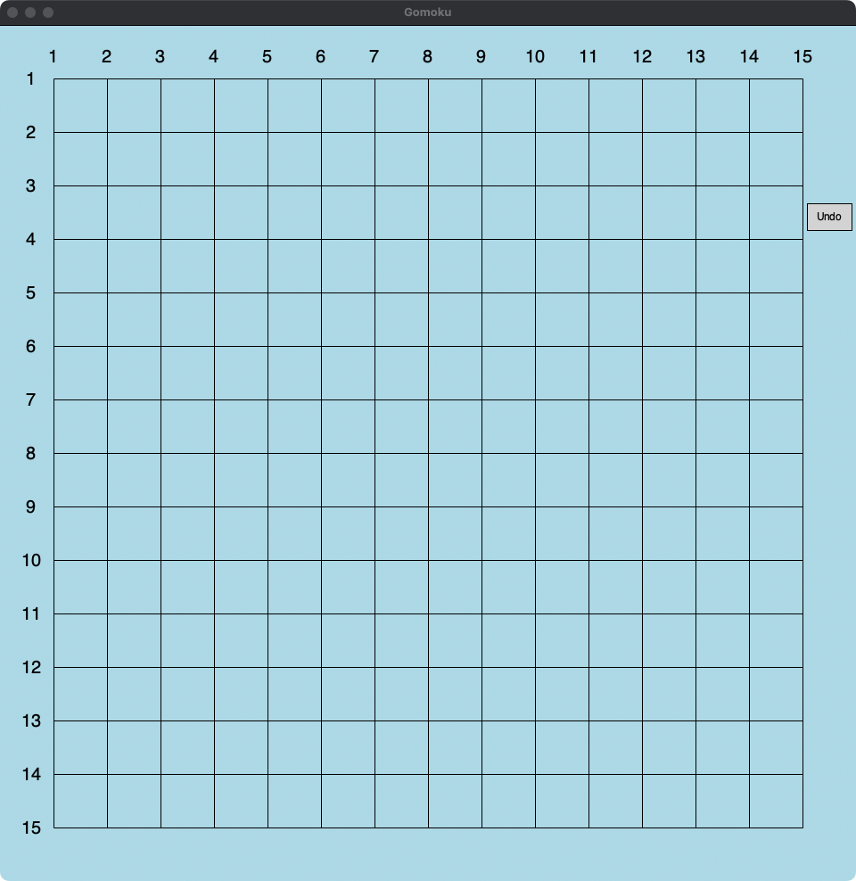

# Gomoku (Five in a Row)
This is a Python project for playing Gomoku with a graphical interface and AI opponent.

## Introduction
The game is played on a 15x15 grid board where two players take turns placing black or 
white stones. The objective is to align five stones in a row either vertically, horizontally, or diagonally.
   - 
   - Above is the initial grid board. 
   - On the top right-hand corner, there is an 'undo' button, 
which is used to retract a false move in a game.
     - Attention! Our undo functionality does not allow undoing twice in one turn, 
and it does not accept undoing and then playing the same move again.
   

## Installation
   - Instructions to ensure Python 3.x is installed and dependencies are installed using `pip`.

## File Structure
- AIvsAI (Easy Mode vs Expert Mode)
- AIvsHuman (AI goes first)
- AIvsHuman (AI goes second)

## Algorithm
- Min-Max 
  - We aim to look ahead enough to make intelligent moves without overwhelming the system with too many calculations.
While deeper searches can yield better evaluation scores, they do not always translate to better moves in practice. 
Therefore, we optimize the depth to maintain a balance between performance and move quality.

- Alpha-Beta pruning
  - The depth we use for clever version is only 2 because we found that depth of 2 
works pretty good, and it does not take too much time. Also, depth of 3 may find a better
evaluation score, but Min-Max is DFS and a better evaluation score does not mean 
a better move. It does not guarantee a better move, but it indeed means a longer time.
So we choose depth of 2.

- Optimization 
  - The `has_neighbor` function checks if a given point has neighboring stones within radius of 1 .
This helps to prioritize moves that are more likely to affect the game outcome. 
  - The `order` function prioritizes potential moves based on their proximity to the last move made. 
This reduces the search space and focuses on more critical moves first.
  

## Contribution
- Pengyu Chen 
  - Optimization
  - Evaluation function (including score parts)
  - Undo button and function 
- Bao Hu 
  - UI design (basic grid board)
  - AI's newest yellow stone
  - Game logic and configuration
  - Min-Max algorithm (including Alpha-Beta pruning)
